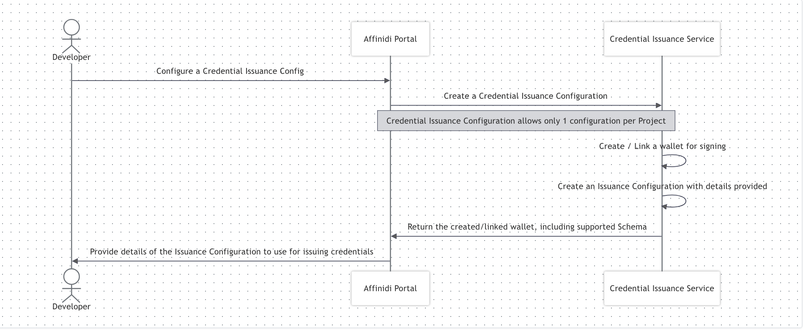
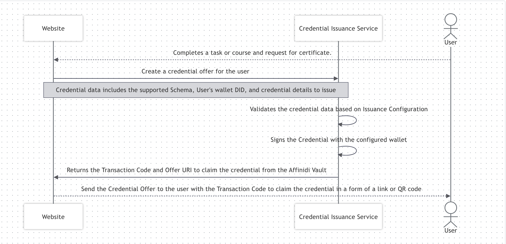
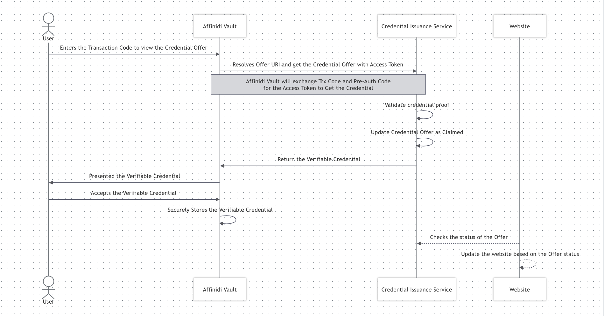
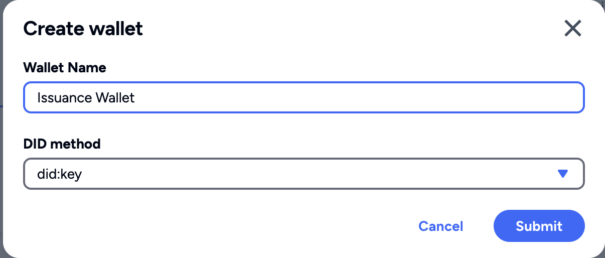
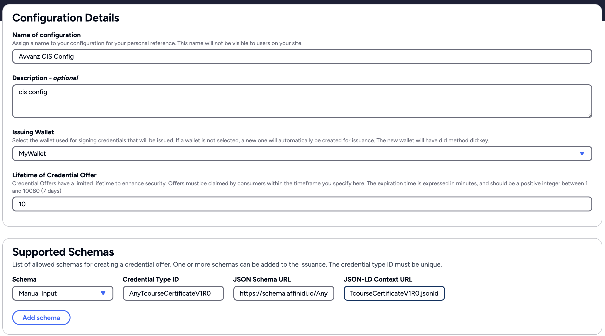

# 🚀 Affinidi Credential Issuance Service Configuration Guide

<div align="center">
  
</div>


> [!IMPORTANT]
> This guide is for learning, experimentation, and prototyping only.
> **Do not use this configuration as-is in production environments.**
> Please review, test, and secure your implementation before deploying to production.


## 📖 Table of Contents
- [Overview](#overview)
- [Architecture](#architecture)
- [Pre-Requisite](#pre-requisite)
- [Setup Instructions](#setup-instructions)
- [Environment Variable Setup](#environment-variable-setup)
- [Supported Schemas](#supported-schemas)
- [Sample Configuration](#sample-configuration)
- [Code Reference](#code-reference)
- [Further Reading](#further-reading)
- [Disclaimer](#disclaimer)


## 🧭 Overview

**Affinidi Credential Issuance Service (CIS)** provides applications with secure methods of issuing and claiming credentials. It implements the [OID4VCI](https://openid.net/specs/openid-4-verifiable-credential-issuance-1_0.html) (OpenID for Verifiable Credential Issuance) protocol, which provides the mechanism for Issuers to issue Verifiable Credentials to Affinidi Vault users and obtain the credentials using the OAuth 2.0 authorisation flow.

More details on Affinidi Credential Issuance Service are available in the [Affinidi Documentation](https://docs.affinidi.com/docs/affinidi-elements/credential-issuance/).


## 🏗️ Architecture

When issuing a Verifiable Credential, three main flows happen within the whole process:

- **Issuance Configuration**

  

- **Credential Issuance Flow**

  

- **Credential Offer Claim [default: TX_CODE]**

  

## Pre-Requisite

> [!IMPORTANT]
> Mandatory steps before proceeding to next steps.

### Create Personal Access Token (PAT)

Personal Access Token (PAT) is like a machine user that acts on your behalf to the Affinidi services. You can use the PAT to authenticate to the Affinidi services and automate specific tasks within your application. A Personal Access Token (PAT) lives outside of Projects, meaning PAT can access multiple projects once granted by the user.

- More details: [Personal Access Token](https://docs.affinidi.com/dev-tools/affinidi-cli/manage-token/#how-does-pat-authentication-works)
- PAT is needed for authenticating to Affinidi APIs. For details on authentication flow and API usage, see [Affinidi APIs Reference](../Affinidi_api.md).

You can refer the [Affinidi Documentation](https://docs.affinidi.com/dev-tools/affinidi-cli/manage-token/#affinidi-token-create-token) for creating pesronal access token from CLI.

**Steps to Create PAT(Personal Access Token):**

1. **Log in to Affinidi CLI:**
   ```sh
   affinidi start
   ```

2. **Create a token:**
   ```sh
   affinidi token create-token
   ```

   Follow the instruction

   ```
    ? Enter the value for name workshopPAT
    ? Generate a new keypair for the token? yes
    ? Enter a passphrase to encrypt the private key. Leave it empty for no encryption ******
    ? Add token to active project and grant permissions? yes
    ? Enter the allowed resources, separated by spaces. Use * to allow access to all project resources *
    ? Enter the allowed actions, separated by spaces. Use * to allow all actions *
   ```

   **Sample response:**
   ```json
    Creating Personal Access Token... Created successfully!
    Adding token to active project... Added successfully!
    Granting permissions to token... Granted successfully!
    {
      "id": "**********",
      "ari": "ari:iam:::token/**********",
      "ownerAri": "ari:iam:::user/**********",
      "name": "workshopPAT",
      "scopes": [
        "openid",
        "offline_access"
      ],
      "authenticationMethod": {
        "type": "PRIVATE_KEY",
        "signingAlgorithm": "RS256",
        "publicKeyInfo": {
          "jwks": {
            "keys": [
              {
                "use": "sig",
                "kty": "RSA",
                "kid": "**********",
                "alg": "RS256",
                "n": "**********",
                "e": "AQAB"
              }
            ]
          }
        }
      }
    }

    Use the projectId, tokenId, privateKey, and passphrase (if provided) to authenticate with Affinidi APIs
    {
      "tokenId": "*******",
      "projectId": "*******",
      "privateKey": "*******",
      "passphrase": "******"
    }
    ›   Warning:
    ›   Please save the privateKey and passphrase (if provided) somewhere safe. You will not be able to view them again.
    ›

   ```

   For more details on the command run the below command

   ```sh
   affinidi token create-token --help
   ```


## ⚙️ Setup Instructions

1. **Access Affinidi Portal:**
   Go to [Affinidi Portal](https://portal.affinidi.com).

2. **Create a Wallet:**
   - Navigate to `Wallets` under the `Tools` section.
   - Click `Create Wallet`, enter a name (e.g., `MyWallet`), and select DID method as `did:key`.
   - 

   For more details, see [Wallets documentation](https://docs.affinidi.com/dev-tools/wallets).

3. **Configure Credential Issuance Service:**
   - Go to `Credential Issuance Service` under `Services`.
   - Click `Create Configuration` and fill in:
     - **Name:** e.g., `MyConfig`
     - **Description:** (optional)
     - **Issuing Wallet:** Select the wallet created above
     - **Lifetime of Credential Offer:** `600` (seconds)

4. **Add Supported Schemas:**
   Click "Add new item" under `Supported Schemas` and enter the following:

## ⚙️ Environment Variable Setup

To enable Affinidi Credential Issuance Service and Personal Access Token authentication in your application, update your `.env` file (or relevant environment configuration) with the following variables:

```env
# CIS Config
CONFIGURATION_ID=""
BACKGROUND_CHECK_CREDENTIAL_TYPE_ID="DigitalCredential"
PERSONAL_INFORMATION_CREDENTIAL_TYPE_ID="PersonalInformationVerification"
ADDRESS_CREDENTIAL_TYPE_ID="AddressVerification"
EDUCATION_CREDENTIAL_TYPE_ID="EducationVerification"
EMPLOYMENT_CREDENTIAL_TYPE_ID="EmploymentVerification"

# Personal Access Token Config
VAULT_URL="https://vault.affinidi.com"
API_GATEWAY_URL="https://apse1.api.affinidi.io"
TOKEN_ENDPOINT="https://apse1.auth.developer.affinidi.io/auth/oauth2/token"
PROJECT_ID=""
TOKEN_ID=""
PRIVATE_KEY=""
```

**Instructions:**
- Fill in the values for `CONFIGURATION_ID`, `PROJECT_ID`, `TOKEN_ID`, and `PRIVATE_KEY` using the details from your Affinidi Portal and Personal Access Token creation steps.
- The credential type IDs should match those configured in your CIS setup.
- Ensure your `.env` file is kept secure and never committed to source control.

> [!IMPORTANT]
> These environment variables are required for your application to interact with Affinidi CIS and Vault services.
> Double-check all values for accuracy to avoid authentication

## 📚 Supported Schemas

| Credential Type ID              | JSON Schema URL                                                      | JSON-LD Context URL                                                  |
|---------------------------------|---------------------------------------------------------------------|---------------------------------------------------------------------|
| PersonalInformationVerification | https://schema.affinidi.io/TPersonalInformationVerificationV1R0.json | https://schema.affinidi.io/TPersonalInformationVerificationV1R0.jsonld |
| AddressVerification             | https://schema.affinidi.io/TAddressVerificationV1R0.json            | https://schema.affinidi.io/TAddressVerificationV1R0.jsonld            |
| EmploymentVerification          | https://schema.affinidi.io/TEmploymentVerificationV1R1.json          | https://schema.affinidi.io/TEmploymentVerificationV1R1.jsonld          |
| EducationVerification           | https://schema.affinidi.io/TEducationVerificationV1R0.json           | https://schema.affinidi.io/TEducationVerificationV1R0.jsonld           |
| DigitalCredential               | https://schema.affinidi.io/personalInfoV1R0.json                     | https://schema.affinidi.io/personalInfoV1R0.jsonld                     |

> [!NOTE]
> You can create as many schema as per your usecase from [schema builder](https://docs.affinidi.com/docs/affinidi-elements/schema-builder/)

## 📝 Sample Configuration




## 💻 Code Reference

### Credential Issuance Flow (Example: Issue Personal Info Credential)

When the **"Issue Personal Info Credential"** button is clicked in the app, the following process occurs:

1. **User Interaction:**
   The user may select the **Revocable** and/or **Expiry** checkboxes before clicking the button.
   - **Revocable:** If checked, the credential will be issued with the ability to be revoked later.
   - **Expiry:** If checked, the credential will include an expiry date, making it valid only until that date.

2. **Form Submission:**
   The form submits a POST request to the current page.
   The button uses `asp-page-handler="IssuePersonalInfo"`, so the request targets the `OnPostIssuePersonalInfo` handler in the page model (`CredentialIssuance.cshtml.cs`).

   ```html
   <form method="post">
       <div class="input-group-text p-3">
           <input class="form-check-input mt-0" type="checkbox" name="revocablePersonalInfo" value="true">
           <span class="ms-2">Revocable</span>
           <input class="form-check-input mt-0 ms-3" type="checkbox" name="expiryPersonalInfo" value="true">
           <span class="ms-2">Expiry</span>
       </div>
       <button asp-page-handler="IssuePersonalInfo" class="btn btn-success btn-lg btn-credential w-100" type="submit">
           Issue Personal Info Credential
       </button>
   </form>
   ```

3. **Razor Page Handler:**
   ASP.NET Core looks for a handler in your page model, for example:
   ```csharp
   public async Task<IActionResult> OnPostIssuePersonalInfo(bool revocablePersonalInfo, bool expiryPersonalInfo)
   {
       // Build credential payload based on checkbox values
       // Call CIS API to issue credential
       // Return result to UI
   }
   ```
   The handler reads the checkbox values and constructs the credential payload accordingly.

4. **Credential Issuance Service (CIS) Interaction:**
   The backend calls Affinidi CIS, passing the payload (including revocable/expiry options).
   CIS issues the credential and returns the result.

5. **Result Display:**
   The page updates to show the issued credential or any error messages.

**Summary:**
- Button click triggers form POST to handler
- Handler reads checkbox values
- Credential is issued with revocable/expiry options if selected
- Result is shown to the user

Refer to [CredentialIssuance.cshtml](/Pages/CredentialIssuance.cshtml) and [CredentialIssuance.cshtml.cs](/Pages/CredentialIssuance.cshtml.cs) and Affinidi Service [CredentialsClient.cs](/util/CredentialsClient.cs) for implementation details.

For Token Generation, refer to [AuthProvider.cs](/util/AuthProvider.cs) and [ProjectScopedToken.cs](/util/ProjectScopedToken.cs)

## 📚 Further Reading

- [Affinidi Credential Issuance Documentation](https://docs.affinidi.com/docs/affinidi-elements/credential-issuance/)
- [Affinidi Portal](https://portal.affinidi.com/)
- [Wallets Documentation](https://docs.affinidi.com/dev-tools/wallets)


## _Disclaimer_

_This documentation is provided for informational purposes only and is not a legal document. For legal terms, conditions, and limitations, please refer to the official Affinidi documentation and your service agreement._
