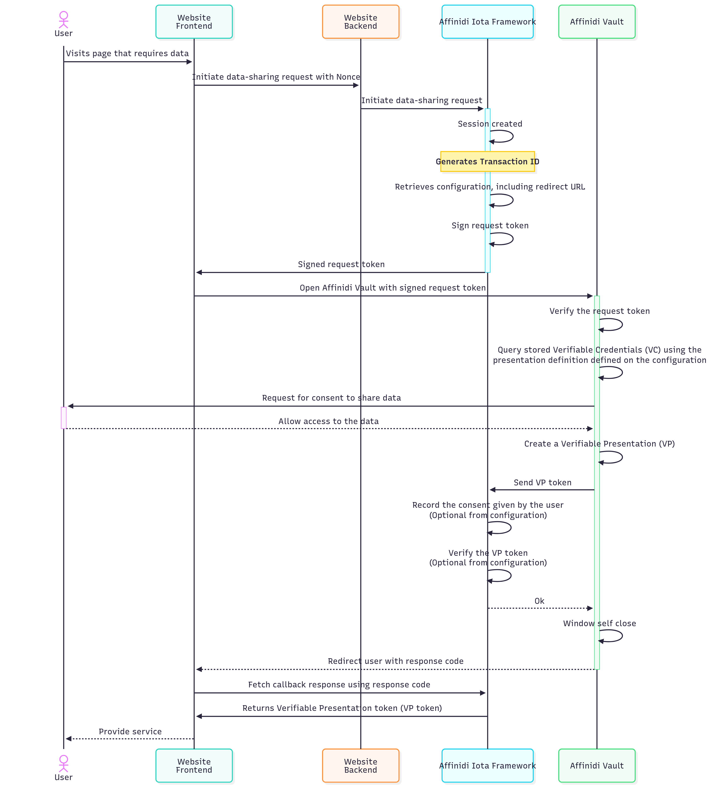

# 🚀 Affinidi Iota Configuration Guide

<div align="center">
  
</div>

> [!IMPORTANT]
> This guide is for learning, experimentation, and prototyping only.
> **Do not use this configuration as-is in production environments.**
> Please review, test, and secure your implementation before deploying to production.


## 📖 Table of Contents
- [Overview](#overview)
- [Architecture](#architecture)
- [Pre-Requisite](#pre-requisite)
- [Setup Instructions](#setup-instructions)
- [Environment Variable Setup](#environment-variable-setup)
- [Presentation Definitions](#presentation-definitions)
- [Code Reference](#code-reference)
- [Further Reading](#further-reading)
- [Disclaimer](#disclaimer)


## 🧭 Overview

**Affinidi Iota Framework** provides a secure and simplified data-sharing process from Affinidi Vault with user consent.
It leverages the [OID4VP](https://openid.net/specs/openid-4-verifiable-presentations-1_0.html) (OpenID for Verifiable Presentation) standard, built on OAuth 2.0, to request and receive credentials.


## 🏗️ Architecture

- **Iota Configuration:**
  Define wallets, redirect flow, and presentation definitions for credential queries.

- **Credential Query Flow:**
  


## 🧑‍💻 Pre-Requisite

> [!IMPORTANT]
> Mandatory steps before proceeding to next steps.

### Create Personal Access Token (PAT)

Personal Access Token (PAT) is like a machine user that acts on your behalf to the Affinidi services. You can use the PAT to authenticate to the Affinidi services and automate specific tasks within your application. A Personal Access Token (PAT) lives outside of Projects, meaning PAT can access multiple projects once granted by the user.

- More details: [Personal Access Token](https://docs.affinidi.com/dev-tools/affinidi-cli/manage-token/#how-does-pat-authentication-works)
- PAT is needed for `Affinidi TDK Auth provider`.

You can refer the [Affinidi Documentation](https://docs.affinidi.com/dev-tools/affinidi-cli/manage-token/#affinidi-token-create-token) for creating pesronal access token from CLI.

**Steps to Create PAT(Personal Access Token):**

1. **Log in to Affinidi CLI:**
   ```sh
   affinidi start
   ```

2. **Create a token:**
   ```sh
   affinidi token create-token
   ```

   Follow the instruction

   ```
    ? Enter the value for name workshopPAT
    ? Generate a new keypair for the token? yes
    ? Enter a passphrase to encrypt the private key. Leave it empty for no encryption ******
    ? Add token to active project and grant permissions? yes
    ? Enter the allowed resources, separated by spaces. Use * to allow access to all project resources *
    ? Enter the allowed actions, separated by spaces. Use * to allow all actions *
   ```

   **Sample response:**
   ```json
    Creating Personal Access Token... Created successfully!
    Adding token to active project... Added successfully!
    Granting permissions to token... Granted successfully!
    {
      "id": "**********",
      "ari": "ari:iam:::token/**********",
      "ownerAri": "ari:iam:::user/**********",
      "name": "workshopPAT",
      "scopes": [
        "openid",
        "offline_access"
      ],
      "authenticationMethod": {
        "type": "PRIVATE_KEY",
        "signingAlgorithm": "RS256",
        "publicKeyInfo": {
          "jwks": {
            "keys": [
              {
                "use": "sig",
                "kty": "RSA",
                "kid": "**********",
                "alg": "RS256",
                "n": "**********",
                "e": "AQAB"
              }
            ]
          }
        }
      }
    }

    Use the projectId, tokenId, privateKey, and passphrase (if provided) to use this token with Affinidi TDK
    {
      "tokenId": "*******",
      "projectId": "*******",
      "privateKey": "*******",
      "passphrase": "******"
    }
    ›   Warning:
    ›   Please save the privateKey and passphrase (if provided) somewhere safe. You will not be able to view them again.
    ›

   ```

   For more details on the command run the below command

   ```sh
   affinidi token create-token --help
   ```


- Create a Wallet in Affinidi Portal (only DID:Key is supported).
- Ensure your redirect URL matches your app endpoint (e.g., `http://localhost:5068/iota`).


## ⚙️ Setup Instructions

1. **Access Affinidi Portal:**
   Go to [Affinidi Portal](https://portal.affinidi.com/login) and navigate to the Iota Framework page.

2. **Create Configuration:**
   - Click **Create Configuration** and set:
     - **Wallet:** Create/select a wallet (DID:Key only).
     - **Data Sharing Flow Mode:** Redirect (reference implementation).
     - **Vault JWT Expiration Time:** Set credential offer lifetime.
     - **Redirect URLs:** `http://localhost:5068/Iota`
   - Optionally enable:
     - **Verification:** Verify credentials shared by users.
     - **Consent Audit Log:** Store user consent logs.

3. **Add Supported Schemas:**
   Define schemas for each credential type you wish to query.

4. **Create Presentation Definitions:**
   Use Presentation Exchange (PEX) to define queries for each VC type (see [Presentation Definitions](#presentation-definitions) below).


## ⚙️ Environment Variable Setup

Update your `.env` file with the required configuration:

```env
# Iota Config Redirect flow : Callback should be is `http://localhost:5068/Iota`
IOTA_CONFIG_ID="your-config-id"
IOTA_CREDENTIAL_QUERY_PERSONAL="your-personal-query-id"
IOTA_CREDENTIAL_QUERY_EMPLOYMENT="your-employment-query-id"
IOTA_CREDENTIAL_QUERY_EDUCATION="your-education-query-id"
IOTA_CREDENTIAL_QUERY_ADDRESS="your-address-query-id"
IOTA_CREDENTIAL_QUERY_SELECTIVE_SHARING="your-selective-sharing-query-id"
```

- Replace each value with the corresponding ID from your Iota configuration.
- Ensure the callback URL matches your app’s endpoint.


## 📚 Presentation Definitions

Define Presentation Exchange queries for each credential type.
Example for **Address Verification VC**:

```json
{
  "id": "address_verification_credentials",
  "input_descriptors": [
    {
      "id": "address_verification",
      "name": "VC",
      "purpose": "Check VC",
      "constraints": {
        "fields": [
          {
            "path": [
              "$.type"
            ],
            "purpose": "VC Type Check",
            "filter": {
              "type": "array",
              "contains": {
                "type": "string",
                "pattern": "AddressVerification"
              }
            }
          }
        ]
      }
    }
  ]
}

```

Example for **Personal Information Verification VC**

 ```json
{
  "id": "personal_information_credentials",
  "input_descriptors": [
    {
      "id": "personal_information",
      "name": "VC",
      "purpose": "Check VC",
      "constraints": {
        "fields": [
          {
            "path": [
              "$.type"
            ],
            "purpose": "VC Type Check",
            "filter": {
              "type": "array",
              "contains": {
                "type": "string",
                "pattern": "PersonalInformationVerification"
              }
            }
          }
        ]
      }
    }
  ]
}
 ```
Example for **Education Verification VC**

```json
{
  "id": "education_information_credentials",
  "input_descriptors": [
    {
      "id": "education_information",
      "name": "VC",
      "purpose": "Check VC",
      "constraints": {
        "fields": [
          {
            "path": [
              "$.type"
            ],
            "purpose": "VC Type Check",
            "filter": {
              "type": "array",
              "contains": {
                "type": "string",
                "pattern": "EducationVerification"
              }
            }
          }
        ]
      }
    }
  ]
}

```
Example for **Employment Verification VC**

```json
{
  "id": "employment_information_credentials",
  "input_descriptors": [
    {
      "id": "employment_information",
      "name": "VC",
      "purpose": "Check VC",
      "constraints": {
        "fields": [
          {
            "path": [
              "$.type"
            ],
            "purpose": "VC Type Check",
            "filter": {
              "type": "array",
              "contains": {
                "type": "string",
                "pattern": "EmploymentVerification"
              }
            }
          }
        ]
      }
    }
  ]
}

```

Example for **Selective Sharing VC**

> option 1 - Minimun and Maximum Credentials required
```json
{
  "id": "token_with_backgroundcheck_vc",
  "purpose": "{\"data_collection_purpose\": \"Analytics,Marketing,Personalisation\",\"request_description\": \"Please provide between 1 and 3 background check VCs.\"}",
  "input_descriptors": [
    {
      "id": "Background check",
      "name": "Background check VC",
      "purpose": "Check if Vault contains the required VC.",
      "group": [
        "background_check_group"
      ],
      "constraints": {
        "fields": [
          {
            "path": [
              "$.type"
            ],
            "purpose": "Check if VC type is correct",
            "filter": {
              "type": "array",
              "contains": {
                "type": "string",
                "pattern": "^.*Verification$"
              }
            }
          }
        ]
      }
    }
  ],
  "submission_requirements": [
    {
      "rule": "pick",
      "min": 1,
      "max": 3,
      "from": "background_check_group"
    }
  ]
}

```

> Option 2 - Define count of Credentials in a request

```json
{
  "id": "token_with_backgroundcheck_vc",
  "purpose": "{\"data_collection_purpose\": \"Analytics,Marketing,Personalisation\",\"request_description\": \"Please provide two background checks.\"}",
  "input_descriptors": [
    {
      "id": "Background check",
      "name": "Background check VC",
      "purpose": "Check if Vault contains the required VC.",
      "group": [
        "background_check_group"
      ],
      "constraints": {
        "fields": [
          {
            "path": [
              "$.type"
            ],
            "purpose": "Check if VC type is correct",
            "filter": {
              "type": "array",
              "contains": {
                "type": "string",
                "pattern": "^.*Verification$"
              }
            }
          }
        ]
      }
    }
  ],
  "submission_requirements": [
    {
      "rule": "pick",
      "count": 7,
      "from": "background_check_group"
    }
  ]
}
```

## 💻 Code Reference

### Iota Credential Query Flow (Example: Query Personal Info Credential)

When the **"Query Personal Info Credential"** button is clicked, the following process occurs:

1. **User Interaction:**
   The user clicks the button in the UI.

2. **Form Submission:**
   The button is inside a form with `method="post"` and `asp-page-handler="QueryPersonalInfo"`.
   This sends a POST request to the page, targeting the `OnPostQueryPersonalInfo` handler in the page model (`Iota.cshtml.cs`).

   ```html
   <form method="post">
       <button asp-page-handler="QueryPersonalInfo" class="btn btn-primary" type="submit">
           Query Personal Info Credential
       </button>
   </form>
   ```

3. **Handler Execution:**
   The handler reads the environment variable `IOTA_CREDENTIAL_QUERY_PERSONAL` to get the query ID.

   ```csharp
   public async Task<IActionResult> OnPostQueryPersonalInfo()
   {
       var queryId = Environment.GetEnvironmentVariable("IOTA_CREDENTIAL_QUERY_PERSONAL");
       // Build query, redirect to Iota, handle callback
   }
   ```

4. **Iota Service Interaction:**
   The backend constructs a credential query using the query ID and calls the Iota service.

5. **Redirect Flow:**
   The user is redirected to the Iota service for authentication and credential sharing.
   After completion, the user is redirected back to the callback URL (e.g., `/Iota`).

6. **Result Display:**
   The page updates to show the shared credential or any error messages.

**Summary:**
- Button click triggers form POST to handler
- Handler uses environment variable for query ID
- Backend interacts with Iota service
- User completes credential sharing flow
- Result is displayed on the page

Refer to [Iota.cshtml](/Pages/Iota.cshtml) and [Iota.cshtml.cs](/Pages/Iota.cshtml.cs) and Affinidi Service [IotaClient.cs](/util/IotaClient.cs) for implementation details.

For Token Generation, refer to [AuthProvider.cs](/util/AuthProvider.cs) and [ProjectScopedToken.cs](/util/ProjectScopedToken.cs)

## 📚 Further Reading

- [Affinidi Iota Documentation](https://docs.affinidi.com/docs/affinidi-elements/iota/)
- [Affinidi Portal](https://portal.affinidi.com/)
- [Presentation Exchange (PEX)](https://identity.foundation/presentation-exchange/)


## _Disclaimer_

_This documentation is provided for informational purposes only and is not a legal document. For legal terms, conditions, and limitations, please refer to the official Affinidi documentation and your service agreement._